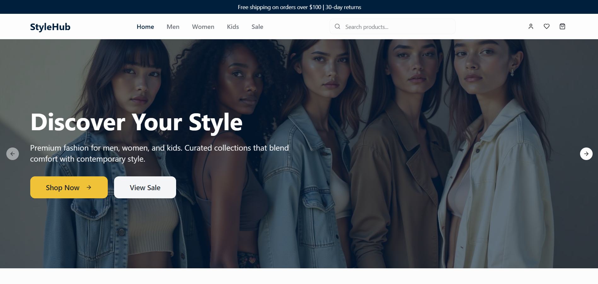

# StyleHub 🛍️

<p align="center">
  
  
  
  
  
</p>

A modern, scalable, and responsive e-commerce platform for a clothing brand, built with a focus on a clean user interface, performance, and a delightful user experience.

**➡️ [Live Demo](https://style-hub-gilt.vercel.app/)** 

---

## 📸 Screenshots



---

## ✨ Features

* ✅ **Product Listings:** Browse products with categories and filtering.
* ❤️ **Wishlist:** Save your favorite items for later.
* 🛒 **Shopping Cart:** Seamlessly add and manage items in your cart.
* 💳 **Streamlined Checkout:** An intuitive checkout process with a billing summary.
* 📱 **Responsive Design:** A mobile-first layout that looks great on any device.
* ✨ **Modern UI/UX:** Smooth animations and transitions for an engaging experience.
* 🔐 **Clean Architecture:** Built with reusability and scalability in mind.

---

## 🛠️ Tech Stack

-   **Frontend:** React (with TypeScript)
-   **Build Tool:** Vite
-   **Styling:** Tailwind CSS
-   **State Management:** React Context API & Custom Hooks
-   **Architecture:** Modular and Component-Based

---

## 🚀 Getting Started

Follow these instructions to get a copy of the project up and running on your local machine.

### Prerequisites

Make sure you have the following installed on your system:

-   [Node.js](https://nodejs.org/en/) (v18.x or newer)
-   [npm](https://www.npmjs.com/) or [yarn](https://yarnpkg.com/)

### Installation

1.  **Clone the repository:**
    ```bash
    git clone [https://github.com/SattvaDoshi/StyleHub.git](https://github.com/SattvaDoshi/StyleHub.git)
    ```

2.  **Navigate to the project directory:**
    ```bash
    cd StyleHub
    ```

3.  **Install dependencies:**
    ```bash
    npm install
    ```

### Running the Application

To start the development server, run the following command:

```bash
npm run dev
```

Open [http://localhost:5173](https://www.google.com/search?q=http://localhost:5173) (or the port shown in your terminal) to view the app in your browser.

### Available Scripts

  - `npm run dev`: Starts the development server with Hot Module Replacement.
  - `npm run build`: Bundles the app for production into the `dist` folder.
  - `npm run preview`: Serves the production build locally to preview it.

-----

## 📁 Folder Structure

The project follows a modular and scalable folder structure designed for clarity and maintainability.

```plaintext
src/
├── assets/          # Static assets (images, logos, fonts)
├── components/
│   ├── layout/      # Layout components (Navbar, Footer, Sidebar)
│   └── ui/          # Reusable UI components (Button, Card, Modal)
├── contexts/        # React Context providers (AuthContext, CartContext)
├── hooks/           # Custom React hooks (e.g., useDebounce, useFetch)
├── lib/             # Utility functions & API helpers
├── pages/           # Page components for each route (Home, Product, etc.)
├── services/        # API service calls (e.g., productAPI.ts)
├── styles/          # Global styles and Tailwind configuration
│   └── index.css    # Main global stylesheet
├── types/           # TypeScript type definitions (Product, User, etc.)
├── App.tsx          # Root component with routing setup
└── main.tsx         # Application entry point
```

-----

## 🤝 Contributing

Contributions make the open-source community an amazing place to learn, inspire, and create. Any contributions you make are **greatly appreciated**.

If you have a suggestion that would make this better, please fork the repo and create a pull request. You can also simply open an issue with the tag "enhancement".

1.  Fork the Project
2.  Create your Feature Branch (`git checkout -b feature/AmazingFeature`)
3.  Commit your Changes (`git commit -m 'Add some AmazingFeature'`)
4.  Push to the Branch (`git push origin feature/AmazingFeature`)
5.  Open a Pull Request

-----

## 📄 License

This project is licensed under the MIT License. See the `LICENSE` file for more details.

-----

## 🙌 Author

**Sattva Doshi**

  - GitHub: [@SattvaDoshi](https://github.com/SattvaDoshi)
  - Specialist in Freelance Web Development, React, and UI/UX.

<!-- end list -->

```
```